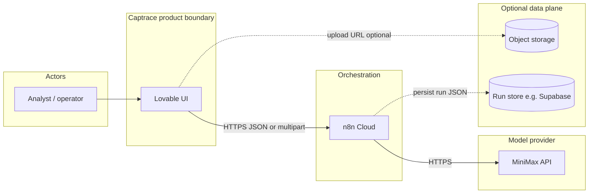
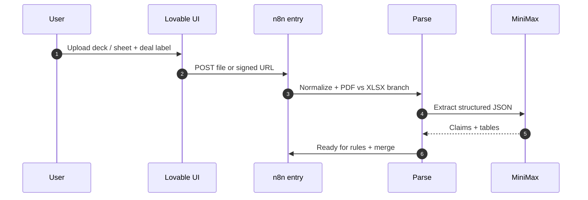
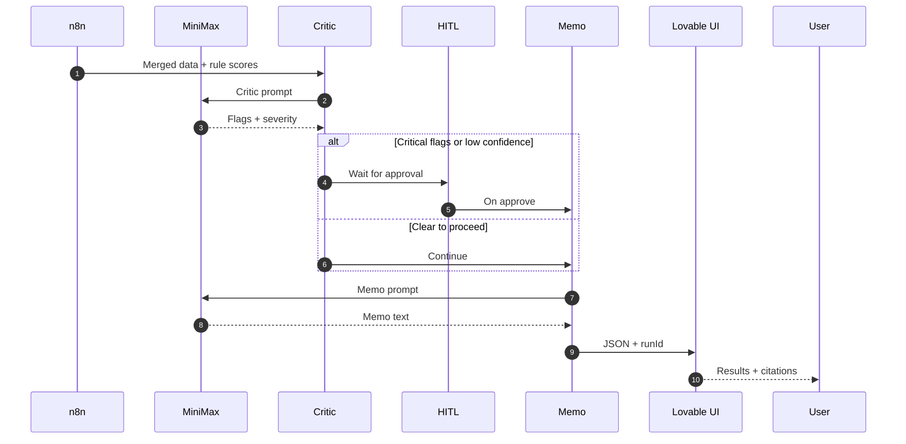
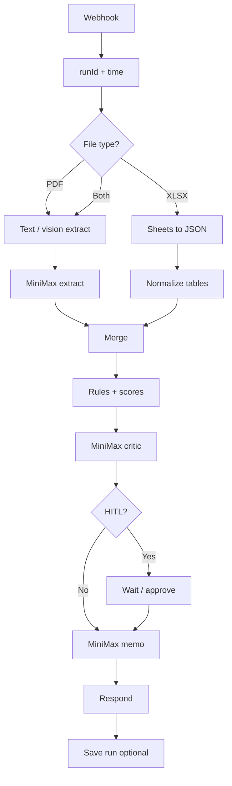

# Welcome to your Lovable project

# Captrace — system architecture

This document describes **how Captrace is built to solve a real workflow problem**, not a slide-only concept. The hackathon demo is a **vertical slice** of this design; the same boundaries apply in production.

---

## 1. Problem and intended impact

**Problem:** Teams that decide on deals, programs, or risk exposure routinely reconcile **narrative** (decks, memos, emails) with **structured numbers** (models, GL extracts, cap tables). That work is slow, error-prone, and hard to audit—especially when AI is used without **traceability** or **human gates**.

**What Captrace does:** It is a **governed ingestion and analysis pipeline**: documents and spreadsheets enter through a controlled API; **n8n** orchestrates deterministic steps and **MiniMax** calls; outputs are **structured**, **cited where possible**, and optionally **held for human approval** before a memo or export is released.

**Impact (production bar):**

| Area | Outcome |
|------|--------|
| Time | Less manual copy-paste between deck, model, and memo. |
| Quality | Systematic cross-check of claims vs tabular data. |
| Trust | Every model call sits behind visible workflow steps (n8n executions). |
| Control | HITL and policy hooks (e.g. “no memo if critical flags”) are first-class. |

**Scope disclaimer:** Captrace does not replace professional judgment or regulated advice. Demo data is illustrative only.

---

## 2. System context

**Boundary rules:**

- **Lovable** owns UX, auth (when you add it), and calling the **single entry webhook**. It should not embed API keys for MiniMax.
- **n8n** owns **secrets**, **branching**, **retries**, **logging**, and **response shaping**.
- **MiniMax** is a **stateless inference dependency**; prompts and outputs are versioned via workflow + optional run records.

---

## 3. End-to-end request flow (actual sequence)

Split into two diagrams so Mermaid (and projectors) do not shrink text. **`captrace-architecture-flow.html`** uses larger fonts and horizontal scroll instead of squashing.

### 3a. Upload and extract

### 3b. Critic, HITL, memo, response

---

## 4. n8n internal pipeline (flowchart)

This is the **canonical node-level story** judges can verify in the **Executions** view.

**Hackathon MVP:** Implement the **main spine** first: Webhook → extract (one file type) → critic → Respond. Add Excel merge, HITL, and persistence as stretch.

---

## 5. Data contracts (minimal)

**Inbound (from UI to n8n):**

- `dealId` (string, optional)
- `runLabel` (string, optional)
- `files[]` or `fileUrl` + `mimeType`
- `clientVersion` (string, optional—for debugging)

**Outbound (n8n to UI):**

- `runId` (UUID)
- `status` (`completed` | `awaiting_approval` | `failed`)
- `extract` (JSON: company, metrics, citations[])
- `flags[]` (severity, message, evidence ref)
- `memo` (string, optional until approved)
- `trace` (optional: step names + timings for UI timeline)

Version these in the workflow **Set** node so you can evolve without breaking the UI.

---

## 6. Production concerns (beyond the demo)

| Topic | Practice |
|--------|----------|
| **Secrets** | MiniMax keys only in n8n credentials; rotate per environment. |
| **PII / confidentiality** | Prefer customer-owned storage + signed URLs; log **hashes** not raw content where possible. |
| **Retention** | Define TTL for uploads and run JSON; expose in privacy policy. |
| **Idempotency** | Optional `Idempotency-Key` header to avoid duplicate runs on double-submit. |
| **Rate limits** | Backoff in n8n; surface `429` to UI gracefully. |
| **Evaluation** | Keep a **golden folder** of decks/sheets and expected flag counts for regression. |

---

## 7. Phased delivery

1. **Phase A — Trustworthy slice:** Single file type, synchronous webhook, extract + critic + JSON UI; n8n execution visible.
2. **Phase B — Dual source:** PDF + XLSX merge path; citation stubs → real page/slide refs.
3. **Phase C — Governance:** HITL, run history (Supabase), role-based UI, idempotency.

---

## 8. Related assets

| Asset | Purpose |
|--------|---------|
| `DEMO_FLOW.md` | On-stage script and checklist |
| `captrace-architecture-flow.html` | Browser-rendered copies of these diagrams |
| `sample-data/` | Synthetic inputs for critic demos |

---

*Architecture reflects intent for a production-grade system; the hackathon build may implement a subset explicitly called out in Phase A.*

